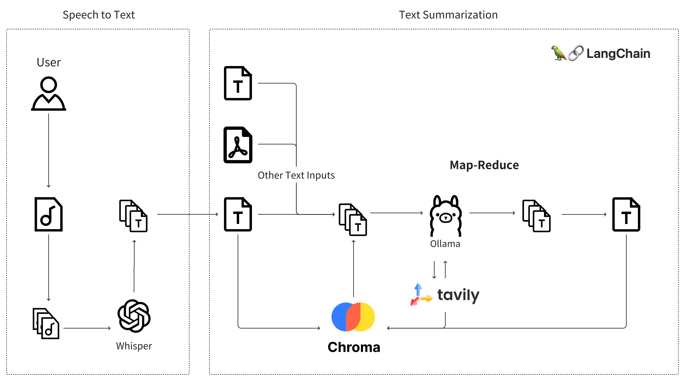

# VIBE – Voice Interpretation and Brief Extraction


Vibe is an AI-powered application designed to help users capture and summarize key information. Whether it's listening to a class lecture or a meeting, Vibe generates concise summaries, acting as your personal assistant for note-taking and keeping track of important points.

## Technical Architecture


## How to run the application
1. Download the dependencies
```shell
pip install -r requirements.txt
```
2. Run the application
```shell
python -m runserver
```
3. Call the API endpoint to generate a summary of the audio file
```shell
curl --location --request POST 'http://127.0.0.1:5656/summarize' \
--form 'file=@"[audio file path]"'
```